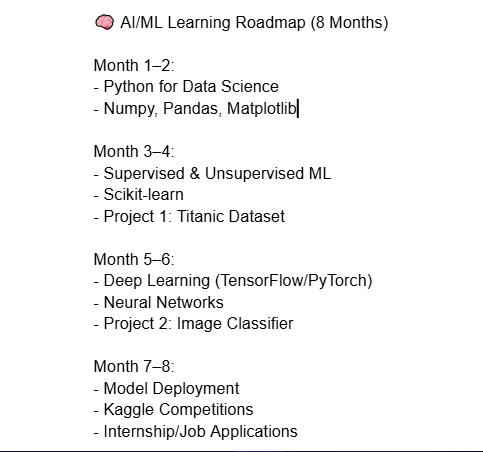

# ml-learning-journey
Documenting my 8-month journey into Machine Learning and Artificial Intelligence.

# 🧠 ML Learning Journey

Welcome! I'm **Caleb Udeibom**, a software developer transitioning into Artificial Intelligence and Machine Learning.

This repository tracks my structured 8-month journey, including:

- 📘 Weekly learning progress
- 🛠️ Projects and experiments
- 🧠 Algorithms and model implementations
- 📈 Learning reflections and goals

---

## 🚀 Current Status: Week 1 – Getting Started

✅ Set up roadmap  
✅ Started Exploratory Data Analysis for Machine Learning 
✅ Made public commitment on [LinkedIn](https://www.linkedin.com/posts/caleb-udeibom-3495a023b_machinelearning-artificialintelligence-learninginpublic-activity-7327981578767286273-nRMF) and [X/Twitter](https://x.com/c_udeibom/status/1922368993127460995)  
✅ Created this GitHub repo

---

📅 I’ll update this each week with progress, notes, and real projects as I grow from beginner to applied ML developer.

Follow the journey or connect with me on LinkedIn if you’re learning too.

✅ Posted my commitment on LinkedIn and Twitter  
✅ Connected with the ML/AI community  

I'll be updating this README every week.

Follow along as I grow from beginner to applied AI developer. 🚀
